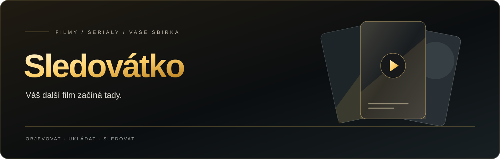
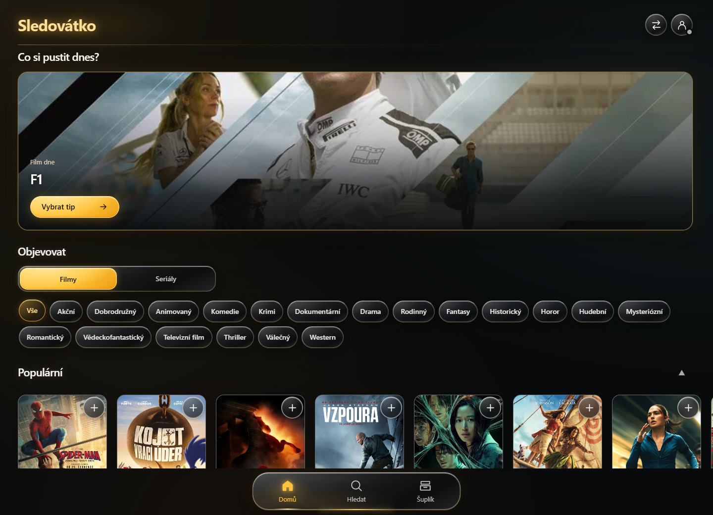

<p align="center">
  
</p>

<p align="center">
  <strong>Objevujte filmy. Ukládejte si tipy. Vyberte si, co sledovat.</strong>
</p>

<p align="center">
  Česká webová aplikace pro objevování filmů a seriálů, správu vlastní sbírky<br>
  a výběr programu na večer. Od telefonu až po velkou obrazovku.
</p>

<p align="center">
  <a href="https://sledovatko.github.io"><strong>Otevřít Sledovátko ↗</strong></a>
  &nbsp; · &nbsp;
  <a href="#co-sledovátko-umí">Funkce</a>
  &nbsp; · &nbsp;
  <a href="#vaše-sbírka-na-vašich-zařízeních">Vaše sbírka</a>
  &nbsp; · &nbsp;
  <a href="#pro-vývojáře">Pro vývojáře</a>
</p>

---

## Váš přehled o tom, co stojí za zhlédnutí

Sledovátko spojuje filmový katalog s osobním seznamem titulů. Najděte něco nového, uložte si to do **Šuplíku** a sledujte, co chcete vidět, co máte rozkoukané a co už jste dokončili. Když nevíte, co si pustit, vyberte si podle času, žánru nebo nálady.

<p align="center">
  <a href="https://sledovatko.github.io">
    
  </a>
  <br>
  <sub>Skutečný náhled aplikace. Nabídka titulů se průběžně mění.</sub>
</p>

## Co Sledovátko umí

| Objevování | Osobní sbírka | Výběr na večer |
| :--- | :--- | :--- |
| Filmy i seriály, žánry, vyhledávání a filtry. | Šuplík se stavy **Chci vidět · Rozkoukané · Viděné**. | Doporučení podle dostupného času a vynechaných žánrů. |
| Řady načítají další tituly při posouvání ke konci. | Vlastní hodnocení, poznámky, štítky a statistiky. | Výběr z uložených titulů nebo nového katalogu. |
| Podobné tituly přímo z nabídky **…** na kartě. | Přehled sledovaných epizod a pokračování seriálů. | Hot or Not a program tří filmů pro filmový večer. |

### Od plakátu k detailu

Jedním klepnutím otevřete popis, hodnocení, stopáž, galerii záběrů a trailer. Tlačítkem **+** uložíte titul do Šuplíku; nabídka **…** zpřístupní další možnosti včetně podobných filmů a seriálů. Akce detailu jsou přehledně umístěné nahoře, hned pod plakátem a základními informacemi o titulu.

### Rozhraní, které dává prostor filmům

Tmavé plochy, průsvitné ovladače a zlaté akcenty doplňují filmové plakáty. Rozložení se přizpůsobuje mobilu, počítači i 4K obrazovce. Filmové řady lze procházet dotykem nebo šipkami; aplikace podporuje ovládání klávesnicí a respektuje systémové omezení pohybu.

## Vaše sbírka na vašich zařízeních

**Začněte bez účtu.** Hledání, místní Šuplík a ruční přenos fungují bez přihlášení. Po přihlášení přes Google můžete používat cloudovou synchronizaci přes Supabase.

| Způsob použití | Jak funguje |
| :--- | :--- |
| **Místní Šuplík** | Sbírka zůstává uložená v daném prohlížeči. |
| **Účet Google** | Přihlášení a cloudová synchronizace sbírky mezi zařízeními. |
| **Ruční přenos** | Odkaz, QR kód nebo soubor `.sledovatko` se snímkem sbírky. Před importem se zobrazí porovnání dat. |
| **Instalace na plochu** | Aplikaci lze přidat na plochu. Offline je dostupný místní Šuplík a dříve načtené základní rozhraní; katalog, nové plakáty a přihlášení potřebují internet. |

Přenosové odkazy a soubory mohou obsahovat vaše poznámky a hodnocení. Sdílejte je pouze se zamýšleným příjemcem.

<p align="center">
  <a href="https://sledovatko.github.io"><strong>Vybrat si další film ↗</strong></a>
</p>

---

## Pro vývojáře

Statická aplikace postavená na **HTML, CSS a JavaScriptu**, hostovaná přes **GitHub Pages**. Filmový katalog využívá TMDB; účty a synchronizaci zajišťuje Supabase. Základní frontend nevyžaduje instalaci balíčků ani vlastní aplikační server.

```sh
python -m http.server 8765
```

Místní náhled otevřete na [localhost:8765](http://localhost:8765). Konfiguraci účtů a backendu popisuje [technická dokumentace](backend/README.md).

<details>
<summary><strong>Nasazení na GitHub Pages</strong></summary>

1. Na původních stránkách si nejprve ulož přenosový kód. Uchovej také původní verzi webu pro případ návratu.
2. Nahraj zdroj do kořene repozitáře a zachovej strukturu včetně `js`, `css`, `icons`, manifestu, `sw.js`, `scripts` a `.github/workflows/pages.yml`. Poté nastav GitHub Settings → Pages → Source na GitHub Actions. Workflow při změně větve `main` přepočítá offline cache a nahraje jen veřejné soubory webu. Lze jej spustit také ručně v Actions. Podrobnosti a alternativa publikování z větve jsou v [backend/README.md](backend/README.md).
3. Ponech současnou doménu a HTTPS. Šuplík je uložený v prohlížeči pro konkrétní doménu; jiná doména nebo jiný prohlížeč vyžaduje ruční přenos.
4. Po zveřejnění obnov stránku a zkontroluj svůj Šuplík. Stávající data `wm_*` se převedou automaticky; původní přenosové kódy jsou nadále podporované.

</details>

<details>
<summary><strong>Architektura, účty a ověření změn</strong></summary>

### Struktura

`css/base.css` a `css/liquid.css` tvoří základ vzhledu a rozložení, `css/concept.css` a `css/effects.css` vizuální efekty. Poslední vrstva `css/usability.css` upravuje ovládání a mobilní mřížky; `css/account.css` pokrývá účty. `js/touch-controls.js` rozlišuje dotyková gesta a zabraňuje dvojímu aktivování karty. Další chování je rozděleno do souborů pro API, data, navigaci, hledání, domovskou stránku, Šuplík a přenos.

`js/config.js` obsahuje veřejnou frontendovou konfiguraci TMDB. Katalog a plakáty potřebují internet a dostupné TMDB API. `js/auth-config.js` obsahuje veřejnou konfiguraci Supabase; tajné klíče patří pouze do nastavení poskytovatele. QR knihovna je přibalená lokálně pod MIT licencí.

Pro místní náhled spusť libovolný statický HTTP server v této složce, například při dostupném Pythonu `python -m http.server 8765`, a otevři `http://localhost:8765`. Při otevírání přes `file://` nemusí fungovat schránka a odkazy mezi zařízeními.

## Stopáže, účty a instalace

Stopáže se načítají automaticky jen pro viditelné karty. Fronta dovolí nejvýše dva současné požadavky a zahajuje je alespoň 350 ms od sebe. Stejný titul má společný požadavek; odchod ze stránky nebo skrytí karty ruší nepotřebné načítání. Cache pojme 600 záznamů: filmy 30 dní, odhad délky dílu a chybějící délky jeden den. Chyby mají prodlevu, HTTP 429 na minutu zastaví frontu. Film ukazuje hodiny:minuty; seriál „≈ 25 min/díl“. Součet všech sezón se neodhaduje potichu.

První úspěšné přihlášení přes Google vytvoří účet ve Sledovátku. Automatická synchronizace používá oddělené knihovny uživatelů a kontrolu revize. Pokud dvě zařízení změní tutéž knihovnu, uživatel vidí porovnání a zvolí další postup. Místní sbírka se do účtu převezme až po výběru uživatele. Neodeslané změny blokují běžné odhlášení; při nucené změně relace zůstane kopie spojená s původním účtem pro jeho další přihlášení. E-mailová registrace a obnova hesla jsou volitelná možnost a ve výchozí konfiguraci jsou vypnuté.

Google používá stejné tlačítko pro přihlášení i první vytvoření účtu, bez nového hesla. U dřívějšího účtu s dosud platnou relací lze v účtu vybrat **Připojit Google k tomuto účtu**, pokud Google ještě není připojený. Výslovné propojení zachová stejné Supabase user ID a sbírku; další přihlášení probíhá přes Google. Historicky připojená identita ani její data se při vypnutí GitHub přihlášení nemažou. Před přesměrováním se uloží rozepsaná poznámka a dokončí synchronizace; nevyřešený konflikt propojení pozastaví. Samotné nahrání zdrojů nemění serverová nastavení poskytovatelů.

Přihlášení přes Google nevyžaduje SMTP. Pro případné zapnutí e-mailové registrace je potřeba vlastní SMTP, potvrzování e-mailu a ověření doručování i obnovy hesla podle [backend/README.md](backend/README.md). Přihlašovací tok dokonči ve stejném prohlížeči a zařízení, kde začal.

Manifest a service worker umožňují instalaci na plochu a opětovné otevření už načteného základního rozhraní při výpadku připojení. V offline režimu je dostupný místní Šuplík; nový katalog, nenačtené plakáty a přihlášení vyžadují síť. Aktualizace má vlastní tlačítko a před výměnou verze ověří dokončení cloudové synchronizace. Auth/API odpovědi se do service worker cache neukládají.

Importy nyní ověřují typy, URL obrázků, rozměry dat a identitu titulů. Poškozený přenos nemůže vložit HTML do karet, chybějící starší pole dostanou bezpečné výchozí hodnoty. Při nedostatku místa se původní hodnoty obnoví. Ruční export zůstává čitelný pro verze 1 a 2.

## Ověření změn

- Sestavení a obsah veřejného balíčku: `node scripts/test-build-cache.cjs`.
- Databázové chování a oddělení účtů: `backend/tests/library.sql`; postup a integrační scénáře jsou v [backend/README.md](backend/README.md).
- Rozhraní: hledání, Šuplík, nabídky karet a účet při 320 a 390 px, tablet při 768 px a desktop při 1280 px; dále skutečný iPhone/Safari, rozlišení klepnutí a posouvání, okrajová gesta, ovládání klávesnicí, import a export.
- Po publikování: přihlášení a odhlášení na veřejné doméně, synchronizace dvou prohlížečů, výpadek sítě a nabídka aktualizace offline kopie.

Výsledky konkrétního nasazení a místní regresní testy eviduj samostatně mimo veřejný balíček. Testovací kopie se simulovaným přihlášením se nepublikují. Databázové testy a místní simulace samy nepotvrzují skutečný OAuth průchod, fyzický iPhone ani synchronizaci mezi zařízeními.

Základní knihovny jsou přibalené: Supabase JS 2.116.0 a qrcode-generator 2.0.4, obě pod MIT licencí. Web nepoužívá plovoucí CDN verze.

</details>

---

<p align="center">
  <strong>SLEDOVÁTKO</strong><br>
  <sub>Filmy a seriály na jednom místě.</sub><br><br>
  <a href="LICENSE">MIT licence</a> ·
  <a href="https://sledovatko.github.io/privacy.html">Soukromí</a> ·
  <a href="https://sledovatko.github.io/terms.html">Podmínky používání</a>
</p>
